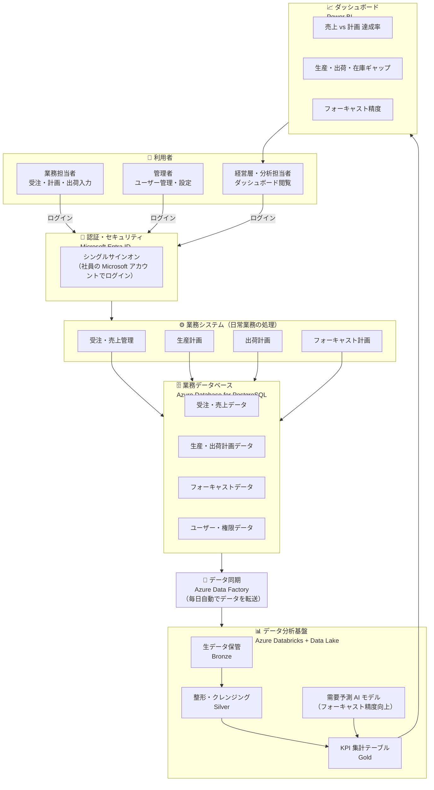

# データベース比較レポート

## 対象サービス

- Azure Cosmos DB
- Azure Database for PostgreSQL
- Azure Databricks (Delta Lake / Lakehouse)
- Microsoft 365 SharePoint（リスト・ライブラリ）

作成日: 2026年3月10日

---

## 1. Azure Cosmos DB

### 概要

Microsoft が提供するフルマネージドの **NoSQL / マルチモデル分散データベース**。グローバル分散と低レイテンシを最大の特徴とする。

### 対応データモデル

| API | データモデル |
|-----|-------------|
| NoSQL (Core) | ドキュメント (JSON) |
| MongoDB | ドキュメント (BSON) |
| Cassandra | ワイドカラム |
| Gremlin | グラフ |
| Table | キー・バリュー |

### 主な特徴

- **グローバル分散**: 複数リージョンへの自動レプリケーション（マルチリージョン書き込み対応）
- **保証されたレイテンシ**: 読み書きともに 99 パーセンタイルで 10ms 以下
- **スキーマレス**: スキーマ変更なしにドキュメント構造を柔軟に変更可能
- **整合性レベル**: Strong / Bounded Staleness / Session / Consistent Prefix / Eventual の 5 段階から選択
- **サーバーレス課金**: RU（Request Unit）ベースまたはサーバーレスモードで従量課金

### 主な用途

- IoT データの収集・リアルタイム処理
- モバイル・Web アプリのユーザープロファイル管理
- カタログ・製品データの管理（ECサイト等）
- ゲームのリーダーボード・セッション管理
- イベントソーシング・CQRS パターン

### メリット

- スキーマレスで開発・変更が高速
- グローバル規模での低レイテンシアクセスを保証
- フルマネージドで運用コストが低い
- Azure サービス（Functions, Event Hubs 等）との統合が容易
- 自動スケーリング（Autoscale）対応

### デメリット

- 複雑な JOIN やトランザクション（複数パーティション）はコストが高い
- RU の見積もりが難しく、コスト管理に習熟が必要
- リレーショナルな集計・分析クエリは苦手
- SQL ライクな NoSQL API は標準 SQL と異なる部分がある
- データ整合性の保証レベルをトレードオフで選択する必要がある

---

## 2. Azure Database for PostgreSQL

### 概要

オープンソース RDBMS である **PostgreSQL** を Azure 上でフルマネージドとして提供するサービス。  
デプロイオプションは **Flexible Server**（推奨）と **Single Server**（廃止予定）の 2 種類。

### 主な特徴

- **ACID トランザクション**: 完全なトランザクション整合性を保証
- **標準 SQL 準拠**: 豊富な SQL 機能（CTE、ウィンドウ関数、JSONB 等）
- **拡張機能**: PostGIS（地理空間）、pgVector（ベクトル検索）、TimescaleDB 等のエクステンション
- **Flexible Server**: ゾーン冗長 HA、カスタムメンテナンスウィンドウ、停止/起動対応
- **接続プーリング**: PgBouncer 組み込み対応

### 主な用途

- 業務システム（ERP、CRM、会計システム）のバックエンド
- トランザクション処理が必要な Web アプリケーション
- 地理空間データ（PostGIS）を活用した位置情報サービス
- AI/ML 向けベクトル検索（pgVector）
- 従来オンプレ PostgreSQL の移行先

### メリット

- 標準 SQL で高い移植性・開発生産性
- 商用 DB（Oracle 等）からの移行コストが比較的低い
- 豊富なエクステンションで機能拡張が容易
- フルマネージドによる自動バックアップ・パッチ適用
- Azure AD 認証・プライベートエンドポイント等のセキュリティ機能
- オープンソースのため追加ライセンスコスト不要

### デメリット

- 垂直スケーリング（スケールアップ）時にダウンタイムが発生する場合がある
- 水平スケーリング（シャーディング）は Citus 拡張が必要で設計が複雑
- 非構造化データの大量処理は Cosmos DB に比べ非効率
- 超大規模な分析ワークロードは Synapse Analytics / Databricks が適切
- Cosmos DB と比較するとグローバル分散構成の構築が複雑

---

## 3. Azure Databricks（Delta Lake / Lakehouse）

### 概要

Apache Spark ベースの **統合データ分析プラットフォーム**。Microsoft と Databricks 社の共同開発による Azure ネイティブサービス。  
Delta Lake 形式によるトランザクション対応のデータレイクハウスアーキテクチャを提供する。

### 主な特徴

- **Delta Lake**: ACID トランザクション対応のオープンテーブル形式（Parquet + トランザクションログ）
- **Unity Catalog**: データガバナンス・アクセス制御・データリネージの統合管理
- **MLflow 統合**: 機械学習の実験管理・モデル管理・デプロイを一元化
- **Auto Loader**: クラウドストレージ（Azure Data Lake Storage）からの増分データ取り込みを自動化
- **Photon エンジン**: C++ ベースのベクトル化実行エンジンにより高速なクエリ処理
- **ノートブック**: Python / Scala / R / SQL のマルチ言語対応

### 主な用途

- 大規模バッチ ETL / ELT パイプラインの構築
- リアルタイムストリーミング処理（Structured Streaming）
- 機械学習・深層学習モデルの開発・学習・運用（MLOps）
- BI・分析向けデータウェアハウス（Lakehouse）
- 大規模データのアドホック分析・データ探索

### メリット

- ペタバイト規模のデータを高速処理できる水平スケーリング
- Delta Lake により ACID 保証とデータ品質管理が可能
- Data Engineer / Data Scientist / Data Analyst の協業環境を統合
- Azure Data Factory / Synapse / Power BI との深い統合
- Cost-efficient なオートスケール Spark クラスタ
- Time Travel（データバージョニング）でいつでも過去のスナップショットを参照可能

### デメリット

- クラスタ起動に数分かかるためリアルタイム OLTP には不向き
- 習熟コストが高い（Spark、Delta Lake、Databricks 固有の概念）
- ランニングコストが高くなりやすい（DBU 課金 + Spark クラスタ）
- ノートブック中心の開発は本番コード管理が煩雑になりやすい
- 小規模データには過剰なインフラとなることが多い
- 従来型 DBA には不慣れな操作体系

---

## 4. Microsoft 365 SharePoint（リスト・ライブラリ）

### 概要

Microsoft 365 の **コラボレーションプラットフォーム** の一部として提供されるドキュメント管理・リスト管理機能。  
SharePoint リストは軽量なデータストアとして利用でき、Power Apps / Power Automate との連携が容易。

### 主な特徴

- **SharePoint リスト**: スプレッドシート的な表形式データ管理（列型：テキスト、数値、選択肢、ルックアップ等）
- **ドキュメントライブラリ**: ファイル（Word、Excel、PDF 等）のバージョン管理・共同編集
- **Power Platform 連携**: Power Apps でのカスタムアプリ構築、Power Automate でのワークフロー自動化
- **Microsoft Graph API**: REST API 経由でのプログラムアクセス
- **アクセス権管理**: Microsoft Entra ID（旧 Azure AD）と統合した細かい権限設定

### 主な用途

- 部門内の業務データ管理（備品管理、申請台帳、顧客リスト等）
- ドキュメントの一元管理・バージョン管理
- Power Apps と組み合わせたノーコード・ローコードアプリの構築
- 社内ポータル・イントラネットのコンテンツ管理
- 承認ワークフローのデータストア

### メリット

- Microsoft 365 ライセンスに含まれるため追加コスト不要
- 専門知識なしでも GUI でデータ管理可能（市民開発者向け）
- Power Apps / Power Automate / Teams との連携が容易
- Microsoft Entra ID との統合によりシングルサインオン対応
- ファイルのバージョン管理・変更履歴が自動で保持される
- Dataverse（Power Platform）との統合も可能

### デメリット

- **データ件数の制限**: リストのアイテム上限 5,000 件ビューしきい値（大規模インデックス未設定時）
- **クエリ性能が低い**: 大量データの複雑なクエリは著しく遅くなる
- **ACID トランザクション非対応**: 同時書き込みによる競合が起きやすい
- リレーショナル DB としての機能が乏しい（JOIN の表現力が限定的）
- API 呼び出しレート制限（スロットリング）がある
- 業務システムの本格的なバックエンドには不適

---

## 5. 比較サマリー

| 観点 | Cosmos DB | PostgreSQL | Databricks | SharePoint |
|------|-----------|------------|------------|------------|
| **データモデル** | NoSQL（マルチモデル） | リレーショナル | Lakehouse（Delta Lake） | リスト / ファイル |
| **スケール** | グローバル分散 / 大規模 | 中〜大規模 | ペタバイト規模 | 小〜中規模 |
| **トランザクション** | 限定的（パーティション内） | 完全 ACID | ACID（Delta Lake） | 非対応 |
| **クエリ言語** | NoSQL API / SQL | 標準 SQL | SQL / Python / Scala | REST API / CAML |
| **リアルタイム OLTP** | ◎ | ◎ | △（クラスタ起動コスト） | △ |
| **大規模分析** | △ | △ | ◎ | ✕ |
| **ML / AI** | △ | △（pgVector） | ◎ | ✕ |
| **運用コスト** | 中〜高 | 低〜中 | 高 | 低（M365 込み） |
| **習熟コスト** | 中 | 低（SQL 知識で対応可） | 高 | 低（GUI 操作可） |
| **向いているチーム** | アプリ開発エンジニア | バックエンドエンジニア | データエンジニア / サイエンティスト | ビジネスユーザー / 市民開発者 |

---

## 6. 選定ガイドライン

```
業務システム / トランザクション処理
  └→ Azure Database for PostgreSQL

グローバル展開 / 低レイテンシ / スキーマ柔軟性
  └→ Azure Cosmos DB

大規模データ分析 / ETL / ML・AI 開発
  └→ Azure Databricks

部門内台帳管理 / ノーコードアプリ / M365 環境
  └→ SharePoint リスト
```

### ハイブリッド構成の例

- **OLTP + 分析分離**: PostgreSQL（トランザクション）→ Databricks（分析・ML）
- **リアルタイム + バッチ**: Cosmos DB（データ収集）→ Databricks（バッチ集計）
- **社内アプリ**: SharePoint（UI / ワークフロー）+ PostgreSQL / Cosmos DB（バックエンド）

---

## 7. 各DBに向いているデータ・システムの具体例

### 7-1. Cosmos DB が向いているデータ・システム

#### 向いているデータ

| データ種別 | 具体例 |
|-----------|--------|
| ドキュメント | ユーザープロファイル（属性が人によって異なる）、商品カタログ |
| イベント / ログ | IoT センサーデータ、アプリケーションイベントログ、クリックストリーム |
| キー・バリュー | セッション情報、キャッシュデータ |
| グラフ | SNS のフォロー関係、レコメンデーショングラフ |

#### トランザクション系システムの具体例

- **EC サイトのカート・注文**: 商品ごとに属性が異なるカートを JSON ドキュメントで管理。注文確定は同一パーティション内でアトミック操作
- **IoT デバイス管理**: デバイスごとのステータスや設定をドキュメントで保持し、リアルタイムに更新
- **ゲームのセッション**: プレイヤーのリアルタイムスコア・状態を低レイテンシで読み書き
- **モバイルアプリの通知設定**: ユーザーごとに異なる設定フィールドをスキーマ変更なしに拡張

#### データ分析システムの具体例

- **Change Feed → Databricks**: Cosmos DB の変更フィードをリアルタイムに Databricks へ流し、受注集計・KPI 算出
- **リアルタイムダッシュボード**: Azure Stream Analytics と組み合わせ IoT データを集計 → Power BI 可視化
- ※Cosmos DB 単体での複雑な集計は不向き。分析は下流サービスに移譲するのがベスト

---

### 7-2. Azure Database for PostgreSQL が向いているデータ・システム

#### 向いているデータ

| データ種別 | 具体例 |
|-----------|--------|
| マスターデータ | 顧客、品目、取引先、組織・ユーザー |
| トランザクションデータ | 受注、売上、在庫移動、支払い、入出荷 |
| 計画データ | 生産計画、フォーキャスト、予算 |
| 設定・ルールデータ | 承認フロー定義、権限設定、アラート閾値 |

#### トランザクション系システムの具体例

- **受注・売上管理**: 受注登録と在庫引当を 1 トランザクションで完結。外部キー制約でデータ整合性を保証
- **生産計画**: 工程マスター・リソース制約を正規化したテーブルで管理。CTE によるスケジュール計算
- **出荷計画**: 出荷ヘッダー / 明細の親子構造を JOIN で管理。出荷指示〜実績の状態遷移をトランザクション制御
- **認証・認可**: ユーザー / ロール / 権限テーブルを厳密な外部キーで管理。ロールベースのアクセス制御（RBAC）
- **フォーキャスト計画**: 需要予測値・確定値を期間×品目のテーブルで管理。バージョン管理も可能

#### データ分析システムの具体例

- **PostgreSQL → Databricks（ETL）**: Azure Data Factory で PostgreSQL の増分データを Delta Lake へ転送し、分析ワークロードを分離
- **ウィンドウ関数による売上分析**: `SUM() OVER (PARTITION BY ...)` で月次・累計集計を SQL のみで実装（小〜中規模データ向け）
- **TimescaleDB 拡張**: 時系列データ（センサー値、KPI 推移）を PostgreSQL 内で高効率に集計

---

### 7-3. Azure Databricks が向いているデータ・システム

#### 向いているデータ

| データ種別 | 具体例 |
|-----------|--------|
| 大規模ログ | アクセスログ、操作ログ、IoT ストリームの全量 |
| 分析用集計データ | 売上実績・計画差異、在庫回転率、KPI サマリー |
| ML トレーニングデータ | 需要予測の特徴量、異常検知の教師データ |
| 非構造化データ | PDF・画像・テキストの前処理結果 |

#### トランザクション系システムの具体例

- ※Databricks はバッチ / ストリーミング分析が主目的。OLTP には不向き
- **Delta Live Tables（DLT）**: データパイプラインの品質チェック・自動修復をトランザクション的に管理
- **Structured Streaming**: Kafka や Event Hub からのリアルタイムストリーム処理（厳密な OLTP ではなくイベント処理）

#### データ分析システムの具体例

- **需要予測モデル**: PostgreSQL の受注実績 + 外部データ（気象・休日）を Delta Lake に集約 → Prophet / LightGBM でフォーキャスト
- **KPI ダッシュボード基盤**: 複数ソース（受注、在庫、出荷）を Databricks で集計 → Gold テーブルを Power BI / Tableau に接続
- **在庫最適化**: 生産・販売・在庫データを横断分析し、安全在庫・リードタイム最適化のシミュレーション
- **バッチ ETL**: 夜間バッチで当日の受注・出荷実績を Delta Lake へ取り込み、翌朝ダッシュボードを更新

---

### 7-4. SharePoint が向いているデータ・システム

#### 向いているデータ

| データ種別 | 具体例 |
|-----------|--------|
| 台帳・マスター（小規模） | 取引先リスト、設備台帳、担当者マスター（〜数千件） |
| ドキュメント | 仕様書、契約書、承認済み帳票 PDF |
| ワークフローのステータス | 申請〜承認〜完了の進捗管理 |
| お知らせ / コンテンツ | 社内ポータル記事、ナレッジベース |

#### トランザクション系システムの具体例

- **備品・設備の申請承認**: Power Apps でフォーム作成 → リストにデータ保存 → Power Automate で承認フロー
- **社内ルール・マスターの管理台帳**: 小規模な取引先情報や製品カタログ（件数が少ない場合）
- *※整合性が必要な業務トランザクション（在庫引当、受注登録など）には不適*

#### データ分析システムの具体例

- **Power BI 接続**: SharePoint リストのデータを Power BI にインポートし、簡易ダッシュボードを構築（件数が少ない場合）
- **Excel / Power Query 連携**: SharePoint のファイルを Power Query で取得し、Excel で集計
- ※大規模分析は Databricks 等に移譲すべき

---

## 8. 業務システム + データ分析ダッシュボードのベストプラクティス

### 対象業務システム

- 認証・認可
- フォーキャスト計画
- 生産計画
- 出荷計画
- 受注・売上管理

---

### 8-1. 推奨アーキテクチャ全体図

```
┌──────────────────────────────────────────────────────────────────────┐
│                         クライアント層                                │
│   Web App / SPA         Admin Portal         Power BI / Tableau      │
└──────────┬───────────────────────┬──────────────────┬───────────────┘
           │                       │                  │
           ▼                       ▼                  ▼
┌──────────────────┐   ┌───────────────────┐  ┌─────────────────────┐
│   API Gateway    │   │  認証・認可 サービス │  │  BI / ダッシュボード  │
│ (Azure API Mgmt) │   │ (Microsoft Entra  │  │  接続レイヤー        │
└────────┬─────────┘   │  ID / MSAL)       │  └──────────┬──────────┘
         │             └───────┬───────────┘             │
         ▼                     │                          │
┌─────────────────────────────────────────────────────────────────────┐
│                      業務サービス層（OLTP）                           │
│                                                                     │
│  ┌──────────────┐  ┌────────────────┐  ┌────────────────────────┐  │
│  │ 受注・売上    │  │  生産計画       │  │  出荷計画               │  │
│  │ サービス     │  │  サービス       │  │  サービス               │  │
│  └──────┬───────┘  └───────┬────────┘  └──────────┬─────────────┘  │
│         │                  │                       │                │
│         └──────────────────┼───────────────────────┘                │
│                            ▼                                        │
│              ┌─────────────────────────┐                            │
│              │ Azure Database for      │                            │
│              │ PostgreSQL（OLTP）       │                            │
│              │ ・受注 / 売上テーブル    │                            │
│              │ ・生産計画テーブル       │                            │
│              │ ・出荷計画テーブル       │                            │
│              │ ・フォーキャストテーブル │                            │
│              │ ・ユーザー / ロールテーブル │                         │
│              └──────────────┬──────────┘                            │
└─────────────────────────────┼───────────────────────────────────────┘
                              │ Azure Data Factory（CDC / 増分同期）
                              ▼
┌─────────────────────────────────────────────────────────────────────┐
│                    データ分析層（Lakehouse）                          │
│                                                                     │
│              ┌─────────────────────────────────────┐               │
│              │  Azure Data Lake Storage Gen2        │               │
│              │  ┌───────────┐  ┌──────────────────┐ │               │
│              │  │ Bronze層  │  │  Silver 層        │ │               │
│              │  │ (生データ) │→ │ (クレンジング済み)│ │               │
│              │  └───────────┘  └────────┬─────────┘ │               │
│              │                          ▼            │               │
│              │                ┌──────────────────┐   │               │
│              │                │  Gold 層          │   │               │
│              │                │ (KPI・集計テーブル)│   │               │
│              │                └──────────────────┘   │               │
│              └─────────────────────────────────────┘               │
│                          ▲ Spark 処理                               │
│              ┌─────────────────────────┐                            │
│              │   Azure Databricks      │                            │
│              │ ・ETL パイプライン       │                            │
│              │ ・フォーキャスト ML モデル│                            │
│              │ ・KPI 集計 / Gold テーブル │                          │
│              └─────────────────────────┘                            │
└─────────────────────────────────────────────────────────────────────┘
```

#### 経営層向け概要図（Mermaid）



---

### 8-2. 各業務システムのDB割り当て

| 業務システム | 主DB | 理由 |
|------------|------|------|
| **認証・認可** | PostgreSQL | ユーザー / ロール / 権限の整合性が必須。外部キー + トランザクション |
| **受注・売上管理** | PostgreSQL | 受注登録〜売上確定の ACID トランザクションが必要 |
| **生産計画** | PostgreSQL | 工程・リソース・BOM の正規化テーブル管理。計画バージョン管理 |
| **出荷計画** | PostgreSQL | 出荷指示〜実績の状態遷移をトランザクション制御 |
| **フォーキャスト計画** | PostgreSQL（入力） + Databricks（ML） | 計画データの保存は PostgreSQL、予測モデルの学習・推論は Databricks |
| **KPI ダッシュボード** | Databricks（Gold テーブル） | 複数システムの横断集計。Power BI から接続 |
| **ドキュメント管理** | SharePoint | 仕様書・承認帳票など。M365 環境に統合済みなら追加コスト不要 |

---

### 8-3. 認証・認可のベストプラクティス

```
Microsoft Entra ID（旧 Azure AD）
  ├── アプリケーション登録（OAuth2 / OIDC）
  ├── グループ / ロール管理
  └── MSAL によるトークン発行
          │
          ▼
  API Gateway（Azure API Management）
  ├── JWT 検証
  └── レート制限 / API キー管理
          │
          ▼
  各業務サービス（PostgreSQL）
  ├── users テーブル（Entra ID の sub / oid で紐付け）
  ├── roles テーブル（business_admin, planner, viewer 等）
  ├── user_roles テーブル
  └── permissions テーブル（リソース × アクション）
```

**ポイント:**
- パスワードハッシュは PostgreSQL に保存せず、Entra ID に委譲
- サービス間通信は Managed Identity + Entra ID で認証（クレデンシャルをコードに埋め込まない）
- PostgreSQL の Row Level Security (RLS) で DB 層でも権限制御を二重化

---

### 8-4. フォーキャスト計画のベストプラクティス

```
PostgreSQL
  └── forecasts テーブル
       ├── forecast_version（計画バージョン管理）
       ├── item_code / customer_code
       ├── period（年月）
       ├── forecast_qty（予測数量）
       └── actual_qty（実績、後から更新）

          │ ADF で増分同期（日次バッチ）
          ▼

Databricks（Silver → Gold）
  ├── 特徴量エンジニアリング
  │    └── 実績データ + 外部データ（休日・季節性）
  ├── MLflow で需要予測モデル管理
  │    └── Prophet / LightGBM で SKU × 期間 の需要予測
  ├── 予測結果を Gold テーブル（Delta Lake）に書き出し
  └── 結果を PostgreSQL の forecasts テーブルに逆書き（任意）
```

**ポイント:**
- 計画入力 UI での確定値は PostgreSQL で管理（ACID 保証）
- 予測値の上書き・バージョン管理も PostgreSQL の `forecast_version` で制御
- Databricks の予測モデルは MLflow で実験管理し、再現性を担保

---

### 8-5. 受注・売上管理のベストプラクティス

```
PostgreSQL テーブル設計（最小構成）

  orders（受注ヘッダー）
  ├── order_id (PK)
  ├── customer_id (FK → customers)
  ├── order_date
  ├── status (draft | confirmed | shipped | invoiced)
  └── total_amount

  order_lines（受注明細）
  ├── order_line_id (PK)
  ├── order_id (FK → orders)
  ├── item_id (FK → items)
  ├── qty
  ├── unit_price
  └── line_amount

  sales（売上）
  └── 請求確定時に order_lines から生成（トランザクション管理）
```

**ポイント:**
- 受注〜在庫引当〜売上確定 は 1 トランザクションで完結
- ステータス遷移は DB 側で CHECK 制約 + アプリ側でバリデーションの二重管理
- 論理削除（`deleted_at`）でデータを物理削除しない

---

### 8-6. データ分析ダッシュボードのベストプラクティス

#### Medallion アーキテクチャ（Databricks）

| レイヤー | 内容 | 更新頻度 |
|---------|------|---------|
| **Bronze** | PostgreSQL からの生データをそのままコピー | 日次 / 時次 |
| **Silver** | NULL 除去・型変換・重複排除・結合 | Bronze 処理後 |
| **Gold** | KPI 集計テーブル（Power BI 直結） | Silver 処理後 |

#### Gold テーブルの具体例

```sql
-- 月次 売上 KPI テーブル（Gold）
CREATE TABLE gold.monthly_sales_kpi AS
SELECT
  DATE_TRUNC('month', order_date)   AS month,
  customer_segment,
  item_category,
  SUM(line_amount)                  AS total_sales,
  COUNT(DISTINCT order_id)          AS order_count,
  SUM(forecast_qty)                 AS forecast_qty,
  SUM(actual_qty)                   AS actual_qty,
  SUM(actual_qty) / NULLIF(SUM(forecast_qty), 0) AS achievement_rate
FROM silver.orders
  JOIN silver.order_lines USING (order_id)
  JOIN silver.forecasts   USING (item_id, month)
GROUP BY 1, 2, 3;
```

#### Power BI 接続設定

- **DirectQuery** ではなく **Import モード**（Gold テーブルは集計済みのため軽量）
- Databricks の SQL Warehouse エンドポイントを Power BI データソースに登録
- Row Level Security は Entra ID グループと Power BI ロールで制御

---

### 8-7. データフロー全体のまとめ

```
[業務入力]
  受注登録 ──→ PostgreSQL（orders, order_lines）
  生産計画入力 → PostgreSQL（production_plans）
  出荷登録 ──→ PostgreSQL（shipments）
  フォーキャスト入力 → PostgreSQL（forecasts）

[データ同期] Azure Data Factory（日次 or 時次）
  PostgreSQL → ADLS Gen2 / Delta Lake（Bronze）

[データ変換] Azure Databricks
  Bronze → Silver（クレンジング）
  Silver → Gold（KPI 集計・予測結果マージ）

[分析・可視化]
  Gold テーブル → Power BI ダッシュボード
  ・受注 vs 売上実績
  ・フォーキャスト達成率
  ・生産 vs 出荷 vs 在庫ギャップ分析
  ・顧客別 / 品目別 / 期間別ドリルダウン
```

---

### 8-8. アーキテクチャ選定チェックリスト

- [ ] トランザクション整合性が必要な業務データ → **PostgreSQL** を選択
- [ ] グローバル分散や低レイテンシが必要 → **Cosmos DB** を追加検討
- [ ] 分析・ML・大規模集計が必要 → **Databricks** を導入
- [ ] M365 環境でのドキュメント管理・承認ワークフロー → **SharePoint** を活用
- [ ] 認証は **Microsoft Entra ID** に集約し、各サービスは JWT 検証のみ行う
- [ ] 分析用 DB と OLTP DB は必ず分離する（同一 DB に分析クエリを投げない）
- [ ] Power BI の接続先は Databricks Gold テーブルのみに統一

---

*本レポートは各サービスの公開情報をもとに作成。料金・機能は変更される場合があります。*
