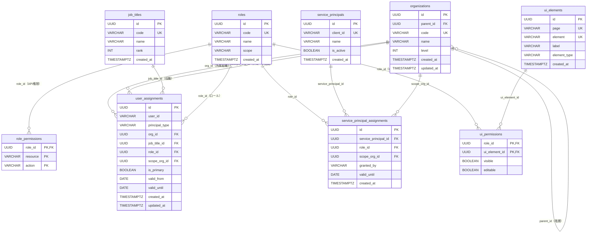
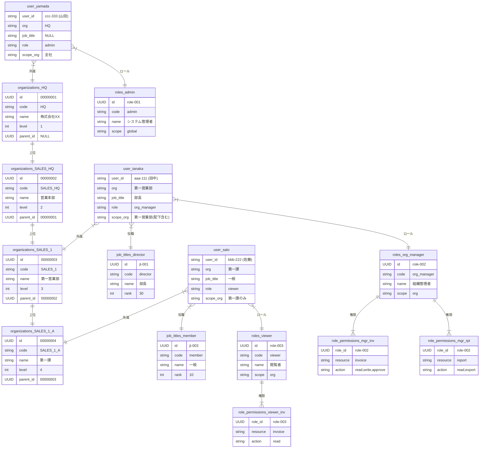

# データ構造（権限DB スキーマ）

## ER 概要

```
organizations (組織マスタ)
  └── user_assignments (ユーザー割り当て)  ← 展開: is_primary / valid_from / valid_until / principal_type
        ├── job_titles (役職マスタ)
        └── roles (ロールマスタ)
              ├── role_permissions  (API権限: resource × action)
              └── ui_permissions    (UI権限: page × element × visible/editable)
                    └── ui_elements (画面要素マスタ)

service_principals (AIエージェント・サービスアカウント)
  └── service_principal_assignments (エージェントのロール割り当て)
        └── roles (ロールマスタ)
```

## ER 図



---

## テーブル定義

### organizations（組織マスタ）

組織の階層構造を自己参照で表現する。

```sql
CREATE TABLE organizations (
    id        UUID         PRIMARY KEY DEFAULT gen_random_uuid(),
    parent_id UUID         REFERENCES organizations(id),  -- 上位組織（NULLは最上位）
    code      VARCHAR(20)  UNIQUE NOT NULL,                -- 部署コード
    name      VARCHAR(100) NOT NULL,                       -- 組織名
    level     INT          NOT NULL,                       -- 1=会社, 2=本部, 3=部, 4=課
    created_at TIMESTAMPTZ NOT NULL DEFAULT now(),
    updated_at TIMESTAMPTZ NOT NULL DEFAULT now()
);
```

| カラム | 型 | 説明 |
|-------|-----|------|
| `id` | UUID | 主キー |
| `parent_id` | UUID | 上位組織ID（NULLは最上位） |
| `code` | VARCHAR | 部署コード（一意） |
| `name` | VARCHAR | 組織名 |
| `level` | INT | 階層レベル（1=会社, 2=本部, 3=部, 4=課） |

---

### job_titles（役職マスタ）

```sql
CREATE TABLE job_titles (
    id         UUID        PRIMARY KEY DEFAULT gen_random_uuid(),
    code       VARCHAR(20) UNIQUE NOT NULL,  -- 'director', 'manager', 'member'
    name       VARCHAR(50) NOT NULL,          -- '部長', '課長', '一般'
    rank       INT         NOT NULL,          -- 数値が大きいほど上位
    created_at TIMESTAMPTZ NOT NULL DEFAULT now()
);
```

| カラム | 型 | 説明 |
|-------|-----|------|
| `id` | UUID | 主キー |
| `code` | VARCHAR | 役職コード（例: `director`, `manager`, `member`） |
| `name` | VARCHAR | 役職名（例: 部長, 課長, 一般） |
| `rank` | INT | 役職の上下関係（大=上位） |

---

### roles（ロールマスタ）

```sql
CREATE TABLE roles (
    id         UUID        PRIMARY KEY DEFAULT gen_random_uuid(),
    code       VARCHAR(50) UNIQUE NOT NULL,  -- 'admin', 'org_manager', 'viewer'
    name       VARCHAR(100) NOT NULL,
    scope      VARCHAR(20) NOT NULL          -- 'global' | 'org' | 'feature'
        CHECK (scope IN ('global', 'org', 'feature')),
    created_at TIMESTAMPTZ NOT NULL DEFAULT now()
);
```

| カラム | 型 | 説明 |
|-------|-----|------|
| `id` | UUID | 主キー |
| `code` | VARCHAR | ロールコード（例: `admin`, `org_manager`, `viewer`） |
| `name` | VARCHAR | ロール名 |
| `scope` | VARCHAR | 適用スコープ（`global` / `org` / `feature`） |

---

### role_permissions（ロール権限）

ロールに対してリソース単位・アクション単位の権限を紐付ける。

```sql
CREATE TABLE role_permissions (
    role_id  UUID        NOT NULL REFERENCES roles(id) ON DELETE CASCADE,
    resource VARCHAR(100) NOT NULL,  -- 'invoice', 'user', 'report'
    action   VARCHAR(20)  NOT NULL,  -- 'read', 'write', 'delete', 'approve'
    PRIMARY KEY (role_id, resource, action)
);
```

| カラム | 型 | 説明 |
|-------|-----|------|
| `role_id` | UUID | ロールID |
| `resource` | VARCHAR | リソース名（例: `invoice`, `user`, `report`） |
| `action` | VARCHAR | 操作種別（`read` / `write` / `delete` / `approve`） |

---

### user_assignments（ユーザー割り当て）

Entra ID ユーザーと組織・役職・ロールを紐付ける中心テーブル。兼務・AIエージェントにも対応。

```sql
CREATE TABLE user_assignments (
    id             UUID         PRIMARY KEY DEFAULT gen_random_uuid(),
    user_id        VARCHAR(100) NOT NULL,         -- Entra ID の oid（人間）または service_principals.id（エージェント）
    principal_type VARCHAR(20)  NOT NULL DEFAULT 'user'
        CHECK (principal_type IN ('user', 'service_principal')),
    org_id         UUID         NOT NULL REFERENCES organizations(id),
    job_title_id   UUID         REFERENCES job_titles(id),
    role_id        UUID         NOT NULL REFERENCES roles(id),
    scope_org_id   UUID         REFERENCES organizations(id),  -- ロールの適用スコープ組織
    is_primary     BOOLEAN      NOT NULL DEFAULT false,         -- 主所属フラグ
    valid_from     DATE,                                        -- 兼務開始日（NULLは即時有効）
    valid_until    DATE,                                        -- 兼務終了日（NULLは無期限）
    created_at     TIMESTAMPTZ  NOT NULL DEFAULT now(),
    updated_at     TIMESTAMPTZ  NOT NULL DEFAULT now(),
    UNIQUE (user_id, org_id, role_id)
);

-- 主所属は1ユーザーにつき1組織のみ
CREATE UNIQUE INDEX uq_user_primary_org
    ON user_assignments (user_id)
    WHERE is_primary = true;
```

| カラム | 型 | 説明 |
|-------|-----|------|
| `user_id` | VARCHAR | Entra ID の `oid`（ユーザー識別子） |
| `principal_type` | VARCHAR | `user`（人間）または `service_principal`（エージェント） |
| `org_id` | UUID | 所属組織ID |
| `job_title_id` | UUID | 役職ID |
| `role_id` | UUID | 付与するロールID |
| `scope_org_id` | UUID | ロールが有効な組織スコープ（NULLはグローバル） |
| `is_primary` | BOOLEAN | 主所属フラグ（1ユーザーにつき1件のみtrue） |
| `valid_from` | DATE | 兼務開始日（NULLは即時有効） |
| `valid_until` | DATE | 兼務終了日（NULLは無期限） |

---

### service_principals（AIエージェント・サービスアカウント）

AIエージェントやバッチ処理などのサービスアカウントを管理する。

```sql
CREATE TABLE service_principals (
    id          UUID         PRIMARY KEY DEFAULT gen_random_uuid(),
    client_id   VARCHAR(100) UNIQUE NOT NULL,  -- Entra ID の appId
    name        VARCHAR(100) NOT NULL,          -- 'ai-invoice-agent', 'batch-reporter'
    description TEXT,
    is_active   BOOLEAN      NOT NULL DEFAULT true,
    created_at  TIMESTAMPTZ  NOT NULL DEFAULT now()
);
```

| カラム | 型 | 説明 |
|-------|-----|------|
| `id` | UUID | 主キー |
| `client_id` | VARCHAR | Entra ID の `appId`（トークンの `appid` クレームと照合） |
| `name` | VARCHAR | サービス名（例: `ai-invoice-agent`） |
| `is_active` | BOOLEAN | 無効化フラグ（falseにすることで即時アクセス停止） |

---

### service_principal_assignments（エージェントのロール割り当て）

エージェントに対してロールと組織スコープを付与する。**有効期限必須**。

```sql
CREATE TABLE service_principal_assignments (
    id                   UUID PRIMARY KEY DEFAULT gen_random_uuid(),
    service_principal_id UUID NOT NULL REFERENCES service_principals(id) ON DELETE CASCADE,
    role_id              UUID NOT NULL REFERENCES roles(id),
    scope_org_id         UUID NOT NULL REFERENCES organizations(id),  -- 全社スコープは原則禁止
    granted_by           VARCHAR(100) NOT NULL,  -- 付与した管理者の oid
    valid_until          DATE NOT NULL,           -- 有効期限必須（無期限付与禁止）
    created_at           TIMESTAMPTZ NOT NULL DEFAULT now(),
    UNIQUE (service_principal_id, role_id, scope_org_id)
);
```

| カラム | 型 | 説明 |
|-------|-----|------|
| `service_principal_id` | UUID | エージェントID |
| `role_id` | UUID | 付与するロールID（`admin` ロールは付与禁止） |
| `scope_org_id` | UUID | 適用組織スコープ（NOT NULL: 全社スコープ禁止） |
| `granted_by` | VARCHAR | 付与した管理者の Entra ID `oid` |
| `valid_until` | DATE | 有効期限（NOT NULL: 無期限付与禁止） |

---

### ui_elements（画面要素マスタ）

アプリケーション内のすべての制御対象UI要素を定義するマスタ。

```sql
CREATE TABLE ui_elements (
    id           UUID         PRIMARY KEY DEFAULT gen_random_uuid(),
    page         VARCHAR(100) NOT NULL,   -- 画面識別子: 'invoice_list', 'invoice_detail'
    element      VARCHAR(100) NOT NULL,   -- 要素識別子: 'btn_approve', 'field_unit_price'
    label        VARCHAR(100) NOT NULL,   -- 管理画面表示名: '承認ボタン', '単価フィールド'
    element_type VARCHAR(20)  NOT NULL    -- 'button' | 'field' | 'section' | 'menu'
        CHECK (element_type IN ('button', 'field', 'section', 'menu')),
    created_at   TIMESTAMPTZ  NOT NULL DEFAULT now(),
    UNIQUE (page, element)
);
```

| カラム | 型 | 説明 |
|-------|-----|------|
| `id` | UUID | 主キー |
| `page` | VARCHAR | 画面識別子（例: `invoice_detail`） |
| `element` | VARCHAR | 要素識別子（例: `btn_approve`） |
| `label` | VARCHAR | 管理画面上の表示名 |
| `element_type` | VARCHAR | 要素種別（`button` / `field` / `section` / `menu`） |

---

### ui_permissions（UI権限）

ロールと画面要素を紐付け、表示可否・編集可否を管理する。

```sql
CREATE TABLE ui_permissions (
    role_id       UUID    NOT NULL REFERENCES roles(id) ON DELETE CASCADE,
    ui_element_id UUID    NOT NULL REFERENCES ui_elements(id) ON DELETE CASCADE,
    visible       BOOLEAN NOT NULL DEFAULT false,  -- 表示するか
    editable      BOOLEAN NOT NULL DEFAULT false,  -- 編集可能か
    PRIMARY KEY (role_id, ui_element_id)
);
```

| カラム | 型 | 説明 |
|-------|-----|------|
| `role_id` | UUID | ロールID |
| `ui_element_id` | UUID | 画面要素ID |
| `visible` | BOOLEAN | 表示可否（false = 非表示） |
| `editable` | BOOLEAN | 編集可否（false = 読み取り専用） |

> `visible=false` の場合、`editable` の値は無視する。

---

## データ例

### 組織階層

| code | name | level | parent |
|------|------|-------|--------|
| `HQ` | 株式会社XX | 1 | NULL |
| `SALES_HQ` | 営業本部 | 2 | `HQ` |
| `SALES_1` | 第一営業部 | 3 | `SALES_HQ` |
| `SALES_1_A` | 第一課 | 4 | `SALES_1` |

### ロールと権限（role_permissions）

| ロールコード | スコープ | resource | action |
|------------|---------|---------|--------|
| `admin` | `global` | `*` | `*` |
| `org_manager` | `org` | `invoice` | `read`, `write`, `approve` |
| `org_manager` | `org` | `report` | `read`, `export` |
| `viewer` | `org` | `invoice` | `read` |
| `viewer` | `org` | `report` | `read` |

### 画面要素マスタ（ui_elements）

| page | element | label | element_type |
|------|---------|-------|-------------|
| `invoice_list` | `btn_create` | 新規作成ボタン | `button` |
| `invoice_detail` | `btn_approve` | 承認ボタン | `button` |
| `invoice_detail` | `btn_delete` | 削除ボタン | `button` |
| `invoice_detail` | `field_unit_price` | 単価フィールド | `field` |
| `invoice_detail` | `field_assignee` | 担当者フィールド | `field` |
| `user_management` | `section_all` | ユーザー管理画面全体 | `section` |

### UI権限マトリクス（ui_permissions）

権限DBに保存するレコードをマトリクス形式で表現。

| page | element | viewer | | org_manager | | admin | |
|------|---------|:------:|:---:|:-----------:|:---:|:-----:|:---:|
| | | visible | editable | visible | editable | visible | editable |
| `invoice_list` | `btn_create` | ✗ | ✗ | ✓ | ✓ | ✓ | ✓ |
| `invoice_detail` | `btn_approve` | ✗ | ✗ | ✓ | ✓ | ✓ | ✓ |
| `invoice_detail` | `btn_delete` | ✗ | ✗ | ✗ | ✗ | ✓ | ✓ |
| `invoice_detail` | `field_unit_price` | ✗ | ✗ | ✓ | ✗ | ✓ | ✓ |
| `invoice_detail` | `field_assignee` | ✓ | ✗ | ✓ | ✗ | ✓ | ✓ |
| `user_management` | `section_all` | ✗ | ✗ | ✗ | ✗ | ✓ | ✓ |

### マトリクスの再現クエリ

ユーザーのロールから該当画面のUI権限を一括取得する。

```sql
-- 指定ユーザー・指定画面の UI権限をマトリクス形式で取得
SELECT
    e.page,
    e.element,
    e.label,
    e.element_type,
    -- 複数ロールを持つ場合は OR で合成（最大権限を採用）
    BOOL_OR(p.visible)  AS visible,
    BOOL_OR(p.editable) AS editable
FROM ui_elements e
LEFT JOIN ui_permissions p
    ON p.ui_element_id = e.id
LEFT JOIN user_assignments ua
    ON ua.role_id = p.role_id
   AND ua.user_id = :user_oid          -- Entra ID の oid
WHERE e.page = :page                   -- 対象画面
GROUP BY e.id, e.page, e.element, e.label, e.element_type
ORDER BY e.element;
```

**レスポンス例** (`page = 'invoice_detail'`, `user = org_manager`):

| element | label | visible | editable |
|---------|-------|:-------:|:--------:|
| `btn_approve` | 承認ボタン | true | true |
| `btn_delete` | 削除ボタン | false | false |
| `field_unit_price` | 単価フィールド | true | false |
| `field_assignee` | 担当者フィールド | true | false |

### ユーザー割り当て例（user_assignments）

| user_id (oid) | principal_type | 所属組織 | 役職 | ロール | is_primary | valid_until |
|--------------|---------------|---------|------|-------|:----------:|------------|
| `aaa-111` | `user` | 第一営業部 | 部長 | `org_manager` | true | NULL |
| `aaa-111` | `user` | 企画部 | 一般 | `viewer` | false | 2026-03-31（兼務） |
| `bbb-222` | `user` | 第一課 | 一般 | `viewer` | true | NULL |
| `ccc-333` | `user` | HQ | - | `admin` | true | NULL |

### AIエージェント例（service_principals / service_principal_assignments）

**service_principals:**

| client_id | name | is_active |
|-----------|------|:---------:|
| `app-abc-001` | ai-invoice-agent | true |
| `app-abc-002` | batch-reporter | true |

**service_principal_assignments:**

| エージェント名 | ロール | scope_org | granted_by | valid_until |
|--------------|-------|-----------|-----------|------------|
| `ai-invoice-agent` | `viewer` | 第一営業部 | `ccc-333`（山田） | 2026-06-30 |
| `batch-reporter` | `viewer` | HQ配下全体 | `ccc-333`（山田） | 2026-12-31 |

## サンプルデータ構成図

実際のデータが入った際の関連イメージ。


